# Uživatelská příručka — Průjezdy vlaků (MQTT monitor)

> Verze aplikace: 2.8 · Poslední aktualizace příručky: 2026-07-20
> Screenshoty v této příručce pocházejí z ukázkové instance s testovacími daty.

## Obsah

1. [O aplikaci](#o-aplikaci)
2. [Role uživatelů](#role-uživatelů)
3. [Přihlášení](#přihlášení)
4. [Příručka pro roli Uživatel](#příručka-pro-roli-uživatel)
   - [Nástěnka](#nástěnka)
   - [Správa zařízení](#správa-zařízení-uživatel)
   - [Data zařízení, grafy a klasifikace](#data-zařízení-grafy-a-klasifikace)
   - [Změna hesla](#změna-hesla)
5. [Příručka pro roli Administrátor](#příručka-pro-roli-administrátor)
   - [Registrace zařízení a přístupová práva](#registrace-zařízení-a-přístupová-práva)
   - [Správa uživatelů a rolí](#správa-uživatelů-a-rolí)
   - [Databáze typů vlaků](#databáze-typů-vlaků)
   - [Chybový log](#chybový-log)
   - [MQTT log](#mqtt-log)
6. [Časté otázky a řešení problémů](#časté-otázky-a-řešení-problémů)

---

## O aplikaci

Aplikace **Průjezdy vlaků** přijímá telemetrii a binární data ze snímačů umístěných u kolejí
(NRF zařízení připojená přes MQTT), ukládá je a automaticky z nich klasifikuje projíždějící
lokomotivu — určí typ, rychlost a zda podvozek nese známky poškození. Výsledky se zobrazují
v přehledném webovém dashboardu.

## Role uživatelů

Aplikace rozlišuje dvě role. Roli přiděluje administrátor v sekci *Správa uživatelů*
(nový účet nemá zpočátku žádnou roli, dokud mu ji někdo nepřiřadí).

| Oblast | **Uživatel** (`user`) | **Administrátor** (`admin`) |
|---|---|---|
| Nástěnka a vlastní/přístupná zařízení | ✅ | ✅ |
| Registrace nového zařízení | ✅ | ✅ |
| Úprava a přístupová práva **vlastních** zařízení | ✅ | ✅ (na všech zařízeních) |
| Zobrazení dat, grafů, klasifikace u zařízení s přístupem | ✅ | ✅ (na všech zařízeních) |
| Mazání záznamů průjezdu | jen s právem editace (`can_edit`) | ✅ vždy |
| Vidí zařízení jiných uživatelů, ke kterým nemá přístup | ❌ | ✅ |
| Správa uživatelů a rolí | ❌ | ✅ |
| Databáze typů vlaků (klasifikační pravidla) | ❌ | ✅ |
| Chybový log a MQTT log | ❌ | ✅ |

Postranní menu se podle role automaticky přizpůsobuje — uživatel bez role administrátora
vidí jen položky *Nástěnka* a *Správa zařízení*.

---

## Přihlášení

Aplikace je dostupná na adrese `http://<adresa-serveru>:5000/`. Nepřihlášený návštěvník je
vždy přesměrován na přihlašovací stránku.

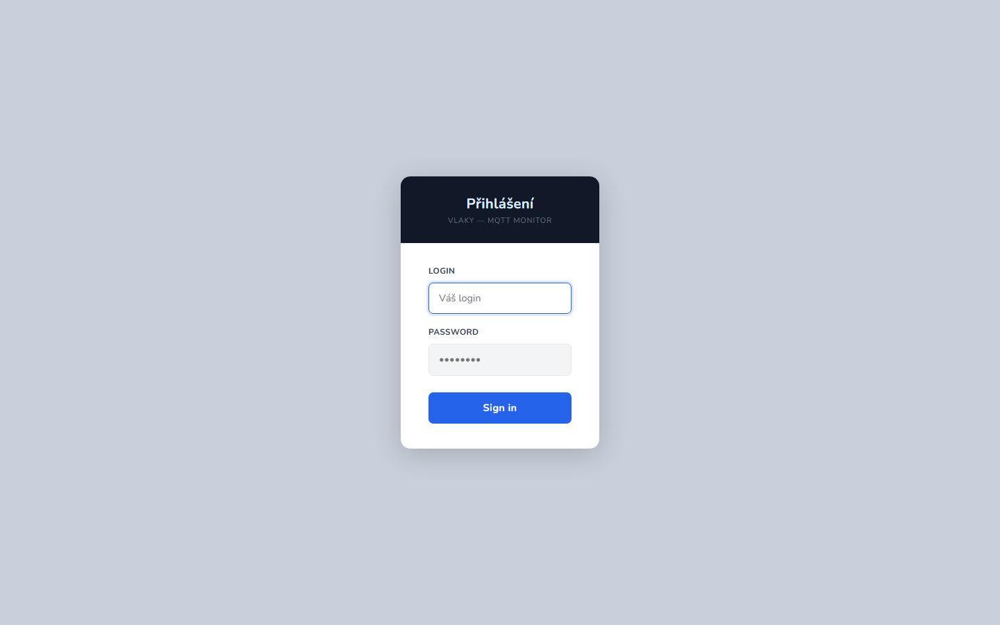

Zadejte svůj **login** a **heslo** a potvrďte tlačítkem *Sign in*. Po 5 neúspěšných pokusech
se přihlášení pro dané uživatelské jméno na 60 sekund uzamkne (ochrana proti hádání hesla).

> **Poznámka:** popisky polí se na této jedné stránce zobrazují anglicky (LOGIN/PASSWORD),
> zatímco zbytek aplikace je česky — jde o kosmetickou drobnost, funkčně to nic nemění.

### První přihlášení do nové instalace

Pokud v databázi zatím neexistuje žádný uživatel, otevřete jednou `/add-user` — vytvoří se
účet `admin` / `admin123`. Přihlaste se a **heslo si ihned změňte** (viz [Změna hesla](#změna-hesla)).
Odkaz se po vytvoření prvního účtu natrvalo uzamkne.

---

## Příručka pro roli Uživatel

### Nástěnka

Po přihlášení se zobrazí *Nástěnka* — přehledové karty se souhrnnými statistikami
(počet zařízení, kolik z nich posílá telemetrii, celkový počet zaznamenaných vlaků a počet
vlaků za poslední týden) a karta pro každé zařízení, ke kterému máte přístup.

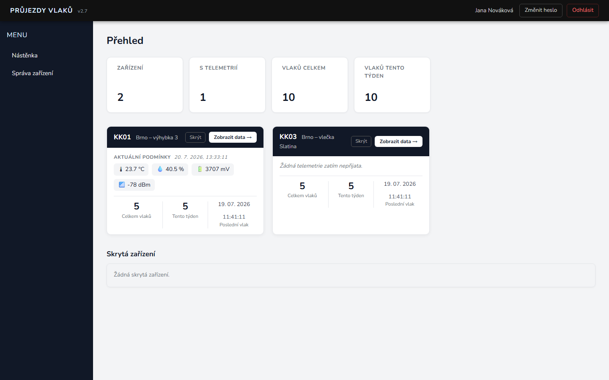

Na kartě zařízení vidíte:
- **Aktuální podmínky** — teplota, vlhkost, napětí baterie a síla signálu z poslední přijaté
  telemetrie (pokud zařízení telemetrii posílá),
- **Statistiky vlaků** — celkem, za tento týden a čas posledního zaznamenaného průjezdu,
- tlačítko **Skrýt** — dočasně schová kartu ze zobrazení (uloženo jen v prohlížeči,
  zpět ji vrátíte v sekci *Skrytá zařízení* pod kartami),
- tlačítko **Zobrazit data →** — otevře podrobný přehled dat daného zařízení.

Karty i souhrnné statistiky se automaticky obnovují každých 15 sekund.

### Správa zařízení {#správa-zařízení-uživatel}

V menu *Správa zařízení* najdete formulář pro registraci nového snímače a tabulku všech
zařízení, ke kterým máte přístup (vlastní i ta, která vám přidělil jejich vlastník nebo admin).

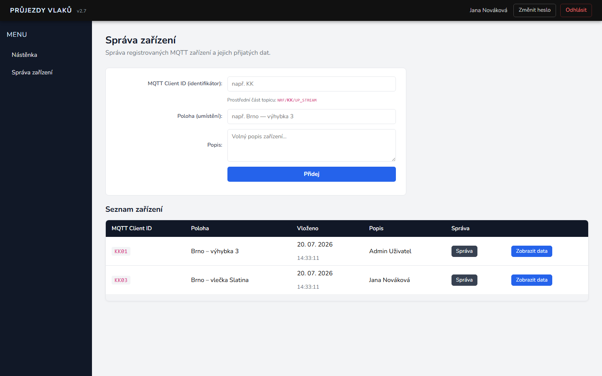

Při registraci vyplňte:
- **MQTT Client ID** — musí přesně odpovídat identifikátoru, který fyzické zařízení posílá
  v MQTT topicu `NRF/<Client ID>/UP_STREAM` (náhled topicu se dopočítává za psaní),
- **Poloha** — kde je zařízení umístěno (např. „Brno — výhybka 3“),
- **Popis** — volitelná poznámka.

Zařízení, které zaregistrujete, se stává vaším — automaticky k němu máte právo úprav.
Odkaz **Správa** u ostatních zařízení je viditelný vždy, ale otevře se jen tehdy, pokud
k danému zařízení máte právo editace (vlastník, administrátor, nebo uživatel, kterému
vlastník nastavil „Může editovat“) — jinak vás aplikace vrátí zpět s hláškou o nedostatečném
oprávnění.

### Data zařízení, grafy a klasifikace

Kliknutím na **Zobrazit data** u konkrétního zařízení se otevře stránka se třemi bloky:
aktuální telemetrie, historie telemetrie a tabulka zaznamenaných průjezdů vlaků.

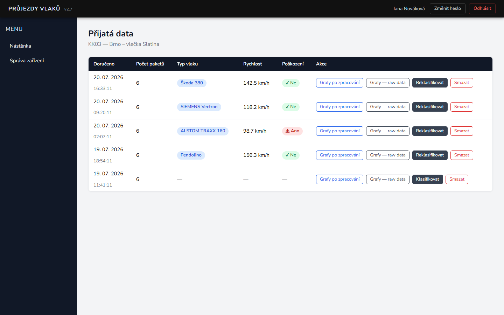

U každého záznamu průjezdu je k dispozici:
- **Typ vlaku**, **rychlost** a **poškození podvozku** — výsledek automatické klasifikace
  (prázdné, dokud záznam neproběhne klasifikací),
- **Grafy po zpracování** — zobrazí filtrovaný signál s vyznačenými detekovanými vrcholy,
- **Grafy — raw data** — zobrazí surová data ze všech čtyř kanálů (proud/napětí, kanál 0 a 1),
- **Klasifikovat / Reklasifikovat** — ručně spustí (znovu) klasifikační algoritmus nad
  uloženými binárními daty,
- **Smazat** — trvale odstraní záznam i binární soubor; tlačítko se zobrazuje jen uživatelům
  s právem editace daného zařízení a akci je nutné potvrdit.

Záznamy označené štítkem „nekompletní“ znamenají, že ze zařízení nedorazily všechny pakety
dané zprávy (např. kvůli výpadku signálu) — klasifikace u nich může být méně přesná nebo
nedostupná.

V grafovém okně lze kolečkem myši přibližovat, tažením posouvat pohled a kliknutím na
položku v legendě jednotlivé kanály skrývat/zobrazovat. Tlačítko *Reset zoom* vrátí
původní pohled.

### Změna hesla

V pravém horním rohu klikněte na **Změnit heslo**, zadejte současné heslo a nové heslo
(minimálně 8 znaků) s potvrzením.

---

## Příručka pro roli Administrátor

Administrátor má k dispozici vše, co role Uživatel, navíc:
- vidí **všechna** registrovaná zařízení bez ohledu na vlastníka a má na nich vždy právo úprav,
- v postranním menu se navíc zobrazují položky *Správa uživatelů*, *Typy vlaků*,
  *Chybový log* a *MQTT log*,
- na nástěnce vidí navíc panel **Live MQTT log** s posledními příchozími MQTT zprávami
  v reálném čase (obnovuje se každé 3 s) — hodí se pro rychlou kontrolu, že zařízení komunikuje
  a zda je jeho Client ID v aplikaci zaregistrované.

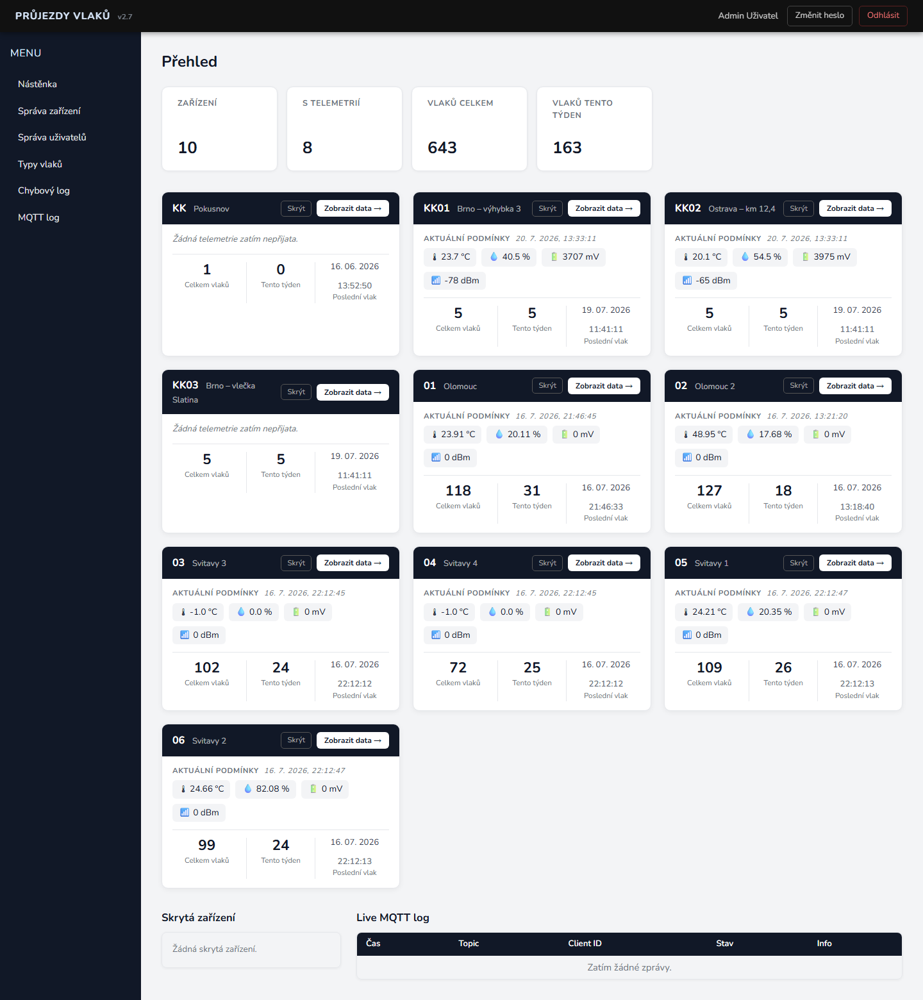

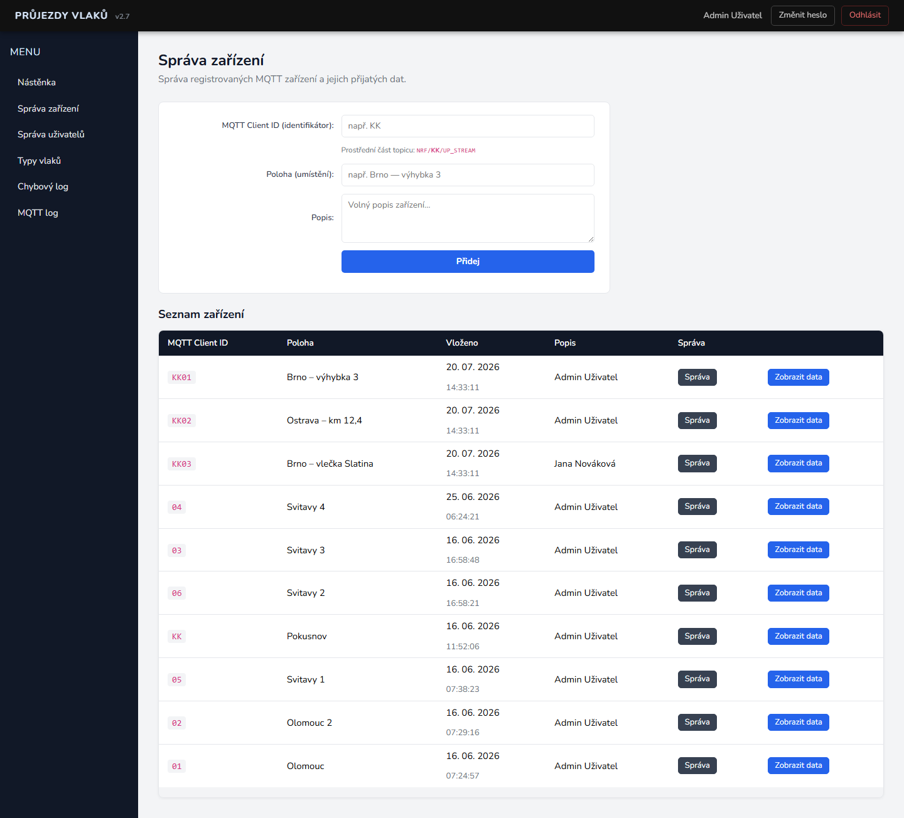

### Registrace zařízení a přístupová práva

Na stránce **Správa** konkrétního zařízení (dostupné z tabulky v *Správě zařízení*) může
administrátor (nebo vlastník/uživatel s právem editace) upravit označení, polohu a popis
zařízení a spravovat, kdo k němu má přístup.

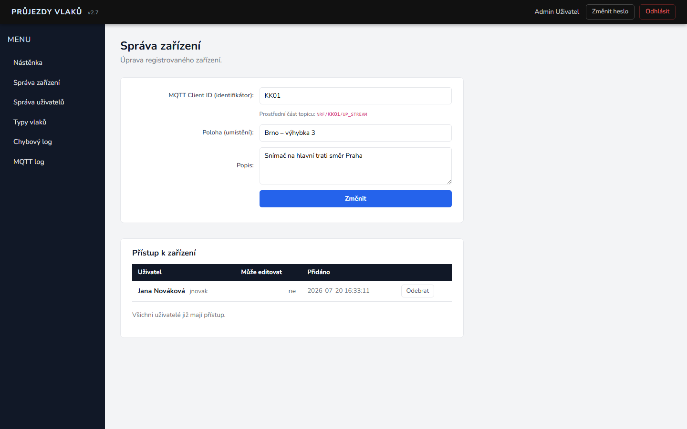

V sekci **Přístup k zařízení**:
- tabulka ukazuje, kteří další uživatelé mají k zařízení přístup a zda smí data i upravovat,
- formulářem dole lze přístup přidělit dalšímu uživateli, volitelně i s právem editace
  (zaškrtávátko „Může editovat“),
- tlačítkem **Odebrat** lze přístup kdykoliv zrušit.

> Pozor: právo editace uděluje danému uživateli i možnost spravovat přístupy dalších lidí
> k tomuto zařízení, ne jen upravovat jeho vlastní data.

Ukázka detailu dat zařízení z pohledu administrátora (se všemi akcemi, včetně mazání
záznamů, dostupnými na jakémkoli zařízení):

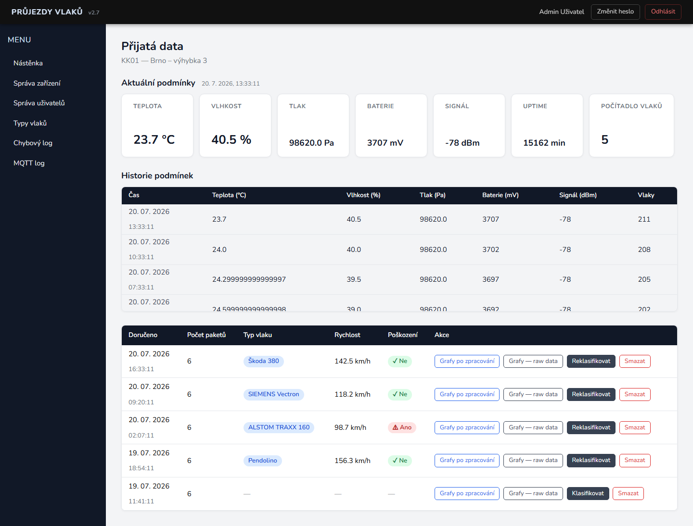

### Správa uživatelů a rolí

V menu **Správa uživatelů** administrátor zakládá nové účty a spravuje existující.

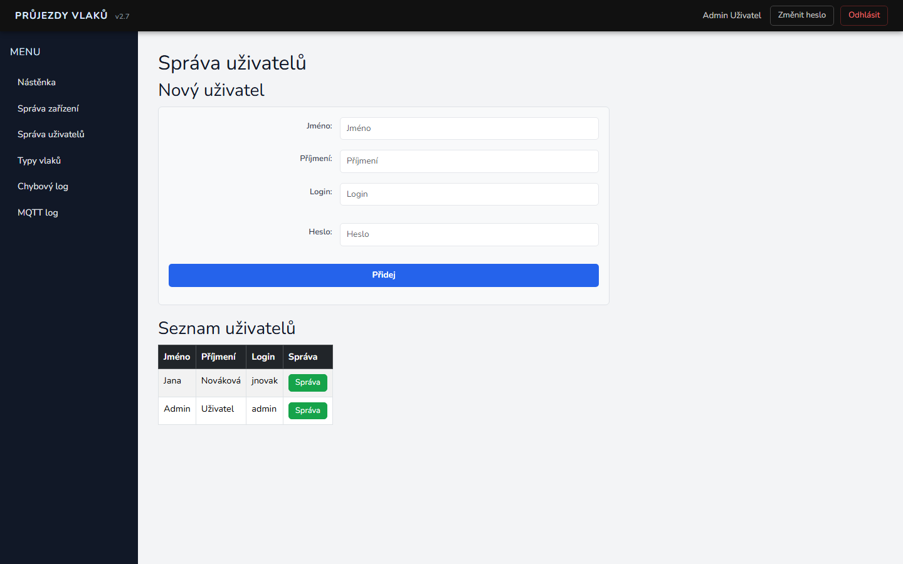

Nový uživatel se zakládá jménem, příjmením, loginem (min. 5 znaků, musí být unikátní —
kontroluje se za psaní) a heslem (min. 8 znaků). **Nově založený účet nemá žádnou roli** —
bez přiřazení role se nemůže do ničeho v aplikaci zapojit kromě přihlášení a vlastních
zařízení, která si sám zaregistruje.

Kliknutím na **Správa** u konkrétního uživatele se otevře jeho detail, kde lze:

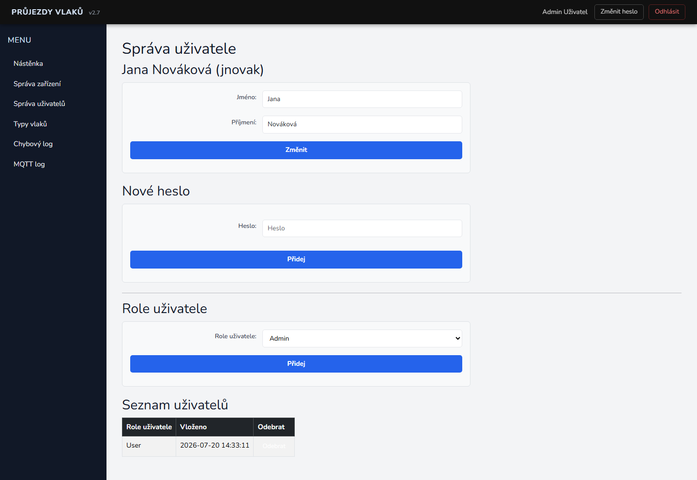

- změnit jméno a příjmení,
- nastavit nové heslo (typicky po zapomenutí),
- **přidat roli** (`user` nebo `admin`) výběrem ze seznamu a potvrzením,
- **odebrat roli** ze seznamu přiřazených rolí uživatele.

Aplikace hlídá dvě pojistky proti uzamčení systému: administrátorskou roli nelze odebrat
poslednímu aktivnímu administrátorovi a nelze odebrat administrátorskou roli sám sobě.

### Databáze typů vlaků

Klasifikační algoritmus rozpoznává typ lokomotivy porovnáním naměřeného časového poměru
mezi detekovanými vrcholy signálu (`dt23/dt12`) s databází známých typů. Tuto databázi
spravuje administrátor v menu **Typy vlaků**.

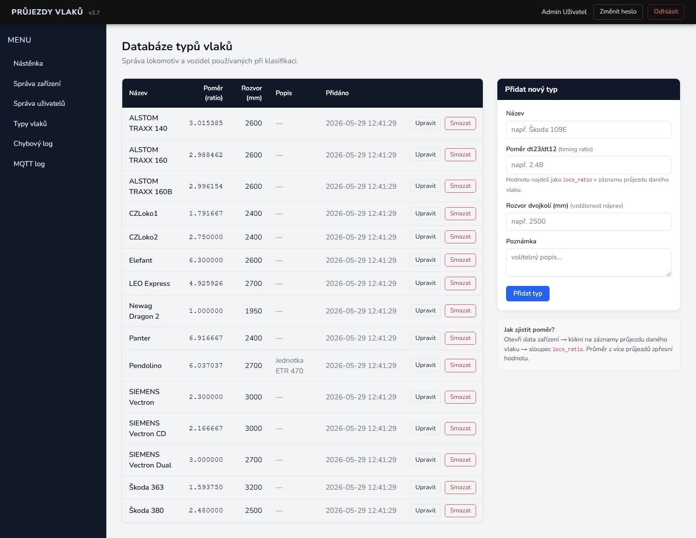

Pro každý typ se eviduje název, poměr (timing ratio), rozvor dvojkolí v mm a volitelný popis.
Novou hodnotu poměru pro dosud nerozpoznaný typ lze zjistit tak, že se podíváte na sloupec
`loco_ratio` u konkrétního průjezdu v datech zařízení — čím více průjezdů stejného typu
zprůměrujete, tím přesnější hodnota vznikne. Existující typ lze upravit tlačítkem *Upravit*
nebo trvale smazat tlačítkem *Smazat* (s potvrzením).

### Chybový log

Menu **Chybový log** zobrazuje posledních 200 zaznamenaných chyb aplikace (neošetřené
výjimky) včetně času, úrovně závažnosti, zdroje a — u chyb se stack trace — rozklikávacího
detailu. Log lze tlačítkem **Vymazat log** kompletně vyprázdnit.

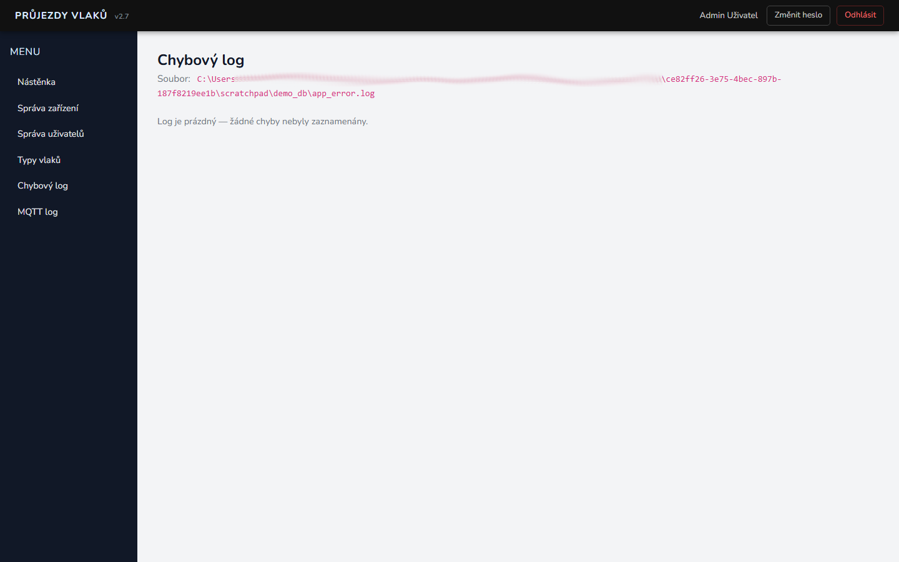

### MQTT log

Menu **MQTT log** obsahuje denní archiv všech přijatých MQTT zpráv (na rozdíl od živého
panelu na nástěnce, který ukazuje jen posledních pár zpráv v paměti). Kliknutím na konkrétní
den se zobrazí detailní seznam zpráv daného dne.

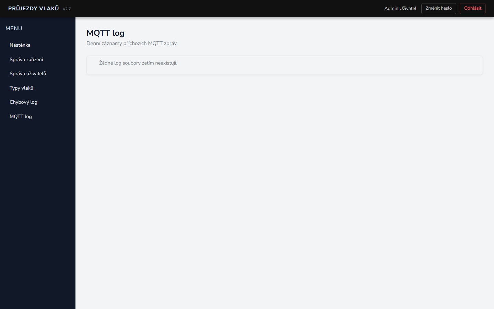

---

## Časté otázky a řešení problémů

**Zařízení posílá data, ale na nástěnce se neobjevuje / je označeno jako „neregistrováno“.**
Zkontrolujte v panelu *Live MQTT log* (administrátor) na nástěnce, jaké Client ID zařízení
skutečně posílá, a zaregistrujte přesně toto ID v *Správě zařízení* — odkaz „Registrovat“
u neregistrované zprávy předvyplní formulář za vás.

**Nevidím v menu Správu uživatelů, Typy vlaků ani logy.**
Tyto sekce jsou dostupné pouze roli *Administrátor*. Požádejte stávajícího administrátora
o přiřazení role v *Detailu uživatele*.

**Kliknu na „Správa“ u zařízení a jsem přesměrován zpět s hláškou o nedostatečném oprávnění.**
K editaci zařízení potřebujete být jeho vlastník, mít od vlastníka/administrátora přidělené
právo „Může editovat“, nebo mít roli administrátora.

**Zapomněl/a jsem heslo.**
Sami si ho změnit nemůžete bez znalosti současného hesla — požádejte administrátora,
ať vám v *Detailu uživatele* nastaví nové.

**Záznam průjezdu má prázdný typ vlaku, rychlost i poškození.**
Buď ještě neproběhla klasifikace (klikněte na *Klasifikovat*), nebo je záznam označen jako
„nekompletní“ a v datech chybí část, kterou algoritmus potřebuje.
